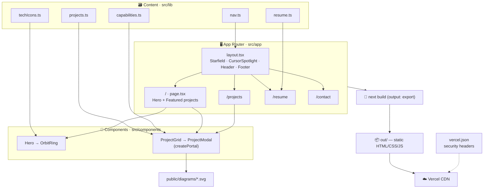

# ✨ Aravind Krishna Kumar — Portfolio


A personal portfolio for a **Data Analytics Manager who ships production software by directing AI coding agents** — a celestial-themed, single-narrative site presenting real project case studies, a resume, and contact links.

> [!NOTE]
> Built as a **fully static site** (Next.js `output: "export"`). The published output is plain HTML/CSS/JS — no server runtime, no database, no forms.

## 🎯 What it is

Four pre-rendered routes — **About** (`/`), **Projects** (`/projects`), **Resume** (`/resume`), **Contact** (`/contact`) — sharing one animated, content-first design system.

## ✨ Features

- 🌌 **Global starfield + cursor spotlight** — a single viewport-fixed animated canvas behind every page, reduced-motion aware.
- 🪐 **Orbiting tech ring** — `Hero` portrait orbited by tool glyphs (`src/lib/techIcons.ts`).
- 🗂️ **Project case-study modals** — `ProjectGrid` → `ProjectModal` (rendered via `createPortal`) showing a pre-rendered architecture diagram and a Problem → Approach → Outcome narrative.
- 📊 **Pre-rendered Mermaid diagrams** — committed SVGs in `public/diagrams/` (see [ADR-002](docs/decisions/ADR-002-mermaid-prerendered-svgs.md)).
- 🔒 **Security headers** — CSP/HSTS/etc. via `vercel.json`.
- ⚡ **Static export** — fast, CDN-cacheable, SEO-friendly with `sitemap.ts` + `robots.ts`.

## 🏗️ Architecture



## 🚀 Getting Started

> [!IMPORTANT]
> Requires **Node.js 20+** and npm.

```bash
npm install          # install dependencies
npm run dev          # dev server → http://localhost:3004
```

Build the static site:

```bash
npm run build        # static export → ./out
npm run lint         # ESLint (flat config)
```

> [!TIP]
> The dev and start scripts are pinned to **port 3004** to avoid local conflicts.

## 🔧 Configuration

| Setting | Where | Notes |
| :--- | :--- | :--- |
| `NEXT_PUBLIC_SITE_URL` | build-time env (Vercel) | Canonical/OG/sitemap base URL. Falls back to `https://example.com` if unset (`src/lib/nav.ts`). |
| Site content | `src/lib/*.ts` | Edit `projects.ts`, `resume.ts`, `nav.ts`, `capabilities.ts` — not JSX. |
| Design tokens | `src/app/globals.css` | Tailwind v4 `@theme` colors/fonts (see [design-system](docs/design-system.md)). |
| Security headers | `vercel.json` | Applied on Vercel deploys only. |

## 📁 Project Structure

| Path | Description |
| :--- | :--- |
| `src/app/` | App Router routes (`/`, `/projects`, `/resume`, `/contact`), `layout.tsx`, `globals.css`, `robots.ts`, `sitemap.ts`. |
| `src/components/` | UI + client components — `Hero`, `OrbitRing`, `Starfield`, `ProjectGrid`/`Card`/`Modal`, `Header`, `Footer`, `Reveal`, `CursorSpotlight`. |
| `src/lib/` | Typed content & config — `projects.ts`, `resume.ts`, `capabilities.ts`, `techIcons.ts`, `nav.ts`. |
| `public/` | Static assets — portrait, `resume.pdf`, pre-rendered `diagrams/*.svg`. |
| `docs/` | ADRs (`decisions/`), design system, per-project case-study context, resume source. |
| `specs/` | Portfolio revamp contract / specifications. |
| `out/` | Build output (generated, git-ignored). |
| `vercel.json` | HTTP security headers. |
| `AGENTS.md` · `CLAUDE.md` | Instructions for AI coding agents. |

## 📦 Deployment

Push to the default branch; Vercel auto-detects Next.js, runs `next build`, and serves `out/` from its CDN. Set `NEXT_PUBLIC_SITE_URL` in the Vercel project. Verify headers post-deploy at [securityheaders.com](https://securityheaders.com).

## 📖 Documentation & Help

- 📝 **ADRs** — [ADR-001 Static export](docs/decisions/ADR-001-next-js-static-export.md) · [ADR-002 Pre-rendered diagrams](docs/decisions/ADR-002-mermaid-prerendered-svgs.md)
- 🎨 **Design system** — [docs/design-system.md](docs/design-system.md)
- 🤖 **For AI agents** — [AGENTS.md](AGENTS.md)
- 🔗 **Maintainer** — [LinkedIn](https://linkedin.com/in/aravind-krishna-kumar-91058a10b) · [GitHub](https://github.com/aravindGitHub1994)
