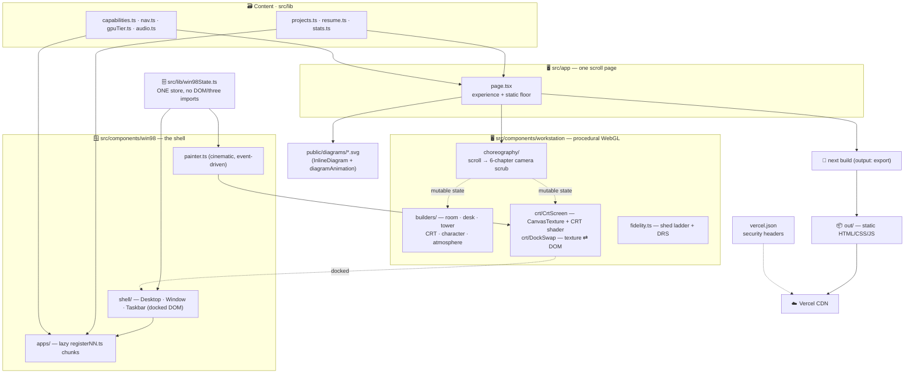

# ✨ Aravind Krishna Kumar — Portfolio


A personal portfolio for a **Data Analytics Manager who ships production software by directing AI coding agents** — a cinematic, scroll-driven WebGL experience called **The Workstation** ([ADR-012](docs/decisions/ADR-012-win98-workstation-cinematic-redesign.md)): the owner's first computer, a **Windows 98 machine at dusk**, with the portfolio living *inside* the CRT.

> [!NOTE]
> Built as a **fully static site** (Next.js `output: "export"`). The published output is plain HTML/CSS/JS — no server runtime, no database, no forms. The 3D layer is decoration: every heading, figure, and body string ships as real semantic DOM for crawlers, ATS, and screen readers.

## 🎯 What it is

One vertical scrub through **six chapters** — **POWER ON · THE GLOW · THE MAN · THE ROOM · THE DOCK · SIGN-OFF** — around one constant object, the monitor. The film opens wide and high from behind the seated figure, on a room with the machine still off; the visitor presses the tower's power button; a BIOS POST counts the owner's real stats as hardware; the camera settles onto the monitor, then finds the person, then the room at dusk. At **THE DOCK** the camera pushes square-on into the screen, the render target cross-fades to **live React DOM**, scroll suspends, and the visitor explores a Windows 98 desktop — Explorer, WordPad, Notepad, Outlook, dial-up shortcuts, Minesweeper, and a Recycle Bin of retired designs. Scrolling out resumes the journey to the sign-off.

Everything in the scene is **generated by code at runtime** — no Blender, no DCC tooling, no imported models ([ADR-012 §3](docs/decisions/ADR-012-win98-workstation-cinematic-redesign.md)).

## ✨ Features

- 🖥️ **The Workstation scene** — room, desk, tower, CRT and a parametric figure, all built by pure seeded builder functions at runtime (`src/components/workstation/builders/`); dusk lighting driven by the screen's own content.
- 📺 **CRT with two renderers, one store** — the Win98 desktop is painted to a 2D canvas and mapped onto curved glass (barrel distortion, scanlines, phosphor mask, flicker) in cinematic mode, then cross-fades to **pixel-aligned live React DOM** when docked, so text is crisp and focus/tab/screen-reader semantics are real ([ADR-012 §4](docs/decisions/ADR-012-win98-workstation-cinematic-redesign.md)).
- 🪟 **A working Windows 98 shell** — draggable, resizable, z-ordered windows, taskbar, Start menu and context menus, all original pixel art. Apps read the same `src/lib/*.ts` content as the static floor and **lazy-load per window** on first open.
- 🔊 **Fully synthesized audio** — boot chime, key clacks, drive chatter, CRT hum and fan bed are generated in WebAudio; **zero audio files ship**. Every cue rides an existing rig's state rather than a clock of its own, so nothing drifts when a frame stalls.
- 🔢 **BIOS POST as a proof band** — the boot sequence counts the owner's real figures as hardware (`Memory: 600+ client accounts ... OK`); every number interpolates from `src/lib/stats.ts`.
- 📊 **Animatable architecture diagrams** — hand-structured SVGs (`public/diagrams/`, [authoring convention](docs/diagram-authoring.md)) that draw on once on entry with a single data-packet pass, then settle.
- 🎚️ **High by default + graceful reduction** — `high` fidelity is served to every capable device (`src/lib/gpuTier.ts`, `?tier=high|low|static` override). Dynamic resolution chases 60 fps; under a sustained 30 fps floor a **shed ladder** drops garnish one rung at a time and only then **asks** before falling back ([design system](docs/design-system.md#fidelity--tiers-drs-and-the-shed-ladder)). `prefers-reduced-motion` and `?tier=static` get a complete, crawlable non-animated floor.
- 🔒 **Security posture** — CSP (`connect-src 'self'`, `font-src 'self'`) with everything local/procedural; security headers via `vercel.json`; no client data in the repo (recreated, dummy-data imagery only). **Zero Microsoft assets** — original icons, original sounds, openly-licensed period fonts ([ADR-012 §10](docs/decisions/ADR-012-win98-workstation-cinematic-redesign.md)).
- ⚡ **Static export** — fast, CDN-cacheable, SEO-friendly with `sitemap.ts` + `robots.ts`.

## 🏗️ Architecture


```mermaid
flowchart TD
    subgraph Page["🖥️ src/app — one scroll page"]
        PG["page.tsx<br/>experience + static floor"]
    end
    subgraph WS["🖥️ src/components/workstation — procedural WebGL"]
        CH["choreography/<br/>scroll → 6-chapter camera scrub"]
        BD["builders/ — room · desk · tower<br/>CRT · character · atmosphere"]
        CRT["crt/CrtScreen — CanvasTexture + CRT shader<br/>crt/DockSwap — texture ⇄ DOM"]
        FD["fidelity.ts — shed ladder + DRS"]
        CH -.mutable state.-> BD & CRT
    end
    subgraph W98["🪟 src/components/win98 — the shell"]
        PT["painter.ts (cinematic, event-driven)"]
        SH["shell/ — Desktop · Window · Taskbar (docked DOM)"]
        AP["apps/ — lazy registerNN.ts chunks"]
        SH --> AP
    end
    ST["🗄️ src/lib/win98State.ts<br/>ONE store, no DOM/three imports"]
    ST --> PT & SH
    PT --> CRT
    CRT -.docked.-> SH
    subgraph Data["🗃️ Content · src/lib"]
        D1["projects.ts · resume.ts · stats.ts"]
        D2["capabilities.ts · nav.ts · gpuTier.ts · audio.ts"]
    end
    PG --> CH
    D1 & D2 --> PG & AP
    PG --> DG["public/diagrams/*.svg<br/>(InlineDiagram + diagramAnimation)"]
    PG --> B["🔨 next build (output: export)"]
    B --> O["📦 out/ — static HTML/CSS/JS"]
    O --> V["☁️ Vercel CDN"]
    VJ["vercel.json<br/>security headers"] -.-> V
```

## 🚀 Getting Started

> [!IMPORTANT]
> Requires **Node.js 20+** and npm.

```bash
npm install          # install dependencies
npm run dev          # dev server → http://localhost:3004
```

Build the static site:

```bash
npm run build        # static export → ./out
npm run lint         # ESLint (flat config)
```

> [!TIP]
> The dev and start scripts are pinned to **port 3004** to avoid local conflicts.
> Append `?tier=high|low|static` to preview a specific fidelity tier.

## 🔧 Configuration

| Setting | Where | Notes |
| :--- | :--- | :--- |
| `NEXT_PUBLIC_SITE_URL` | build-time env (Vercel) | Canonical/OG/sitemap base URL. Falls back to `https://example.com` if unset (`src/lib/nav.ts`). |
| Site content | `src/lib/*.ts` | Edit `projects.ts`, `resume.ts`, `stats.ts`, `nav.ts`, `capabilities.ts` — not JSX. |
| Design tokens | `src/app/globals.css` | Tailwind v4 `@theme` — see [design-system](docs/design-system.md). |
| Fidelity tiers | `src/lib/gpuTier.ts` | `high` by default; FPS watchdog prompts before downgrading; `?tier=` override (also overrides a stored choice). |
| Shed ladder | `src/components/workstation/fidelity.ts` | Rungs, grace window and EMA constants for the 30 fps defence — see [design system](docs/design-system.md#fidelity--tiers-drs-and-the-shed-ladder). |
| Security headers | `vercel.json` | Applied on Vercel deploys only. |

## 📁 Project Structure

| Path | Description |
| :--- | :--- |
| `src/app/` | App Router — the one page, `layout.tsx`, `globals.css`, `robots.ts`, `sitemap.ts`. |
| `src/components/workstation/` | The 3D experience — `builders/` (procedural geometry), `crt/` (screen texture + dock swap), `choreography/` (scroll → camera), `scene/`, `fidelity.ts`. |
| `src/components/win98/` | The shell — `painter.ts` (cinematic canvas), `shell/` (docked DOM), `apps/` (lazy-loaded windows), `pixelIcons.tsx`. |
| `src/lib/` | Typed content & config — `projects.ts`, `resume.ts`, `stats.ts`, `capabilities.ts`, `nav.ts`, `gpuTier.ts`, `diagramAnimation.ts`, plus `win98State.ts`, `audio.ts`, `bootScript.ts`, `minesweeper.ts`, `prng.ts`. |
| `public/` | Static assets — `resume.pdf`, `diagrams/*.svg`, `screens/` recreated imagery, `fonts/` + `audio/` with `LICENSES.md`. |
| `docs/` | ADRs (`decisions/`), [design system](docs/design-system.md), [diagram authoring](docs/diagram-authoring.md), implementation plans, per-project context. |
| `out/` | Build output (generated, git-ignored). |
| `vercel.json` | HTTP security headers. |
| `AGENTS.md` · `CLAUDE.md` | Instructions for AI coding agents. |

## 📦 Deployment

Push to the default branch; Vercel auto-detects Next.js, runs `next build`, and serves `out/` from its CDN. Set `NEXT_PUBLIC_SITE_URL` in the Vercel project. Verify headers post-deploy at [securityheaders.com](https://securityheaders.com).

## 📖 Documentation & Help

- 📝 **ADRs** — [ADR-012 The Workstation](docs/decisions/ADR-012-win98-workstation-cinematic-redesign.md) (current experience layer) · [ADR-001 Static export](docs/decisions/ADR-001-next-js-static-export.md) · [ADR-002 Prerendered SVG diagrams](docs/decisions/ADR-002-mermaid-prerendered-svgs.md). ADR-005…ADR-011 describe **The Lens**, the retired predecessor — kept as immutable records, each carrying a superseded pointer at the top.
- 🎨 **Design system** — [docs/design-system.md](docs/design-system.md)
- 📊 **Diagram authoring** — [docs/diagram-authoring.md](docs/diagram-authoring.md)
- 🤖 **For AI agents** — [AGENTS.md](AGENTS.md)
- 🔗 **Maintainer** — [LinkedIn](https://linkedin.com/in/aravind-krishna-kumar-91058a10b) · [GitHub](https://github.com/aravindGitHub1994)
