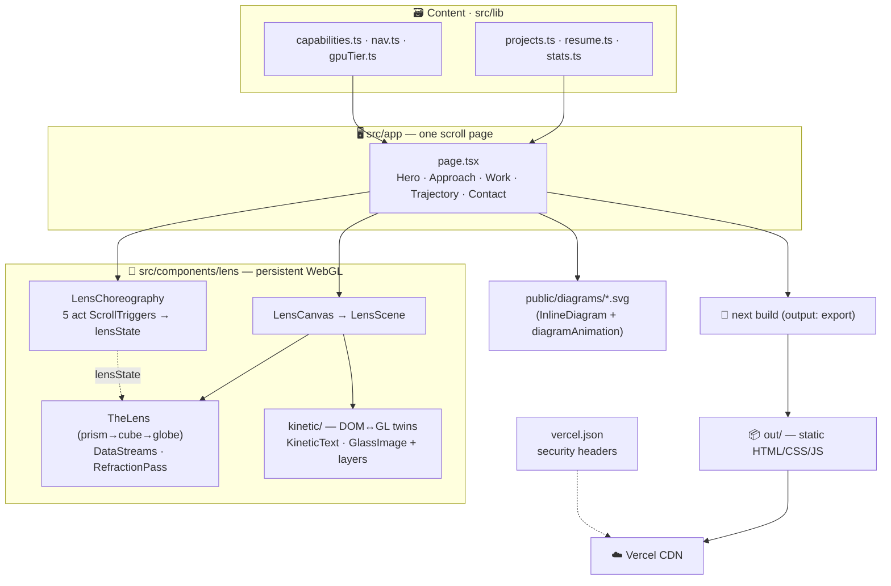

# ✨ Aravind Krishna Kumar — Portfolio


A personal portfolio for a **Data Analytics Manager who ships production software by directing AI coding agents** — one dark, scroll-driven page built around **The Lens** ([ADR-006](docs/decisions/ADR-006-lens-refractive-redesign.md)): a WebGL dispersion prism that refracts streams of raw *data packets* into ordered *insight-beams*, enacting **data → meaning → insight** across five acts.

> [!NOTE]
> Built as a **fully static site** (Next.js `output: "export"`). The published output is plain HTML/CSS/JS — no server runtime, no database, no forms. The WebGL layer is decoration: every heading, figure, and body string ships as real semantic DOM for crawlers, ATS, and screen readers.

## 🎯 What it is

One scrolling page in five acts — **Hero · Approach · Work · Trajectory · Contact** — where a persistent WebGL scene works the story around one constant object ([ADR-008](docs/decisions/ADR-008-projection-work-act-and-prism-finale.md)): the prism refracts data into insight, turns **projector** during Work (its beams curve into each project's Safari-framed window), eases home through Trajectory, and ends with its beams forming a soft **underline beneath the contact CTA**.

## ✨ Features

- 🔷 **The Lens** — dispersion prism (`MeshTransmissionMaterial`), stateless vertex-shader particle streams, and five spectrum light-blades; scroll choreography via GSAP ScrollTrigger + Lenis.
- 🌀 **Pointer refraction pass** — a screen-space displacement + chromatic-aberration field around the pointer, keyed to pointer speed and scroll velocity (high tier, fine pointers only).
- 🔤 **Kinetic type** — display text renders as GL twins of the real DOM elements, which stay selectable and indexable underneath. Headings, stat figures, and the small eyebrow / `01 / 05` labels *refract in* from chromatic shards; body copy, taglines, and stat labels join as **distortion-only** twins (crisp on entry, aberrating near the pointer; ADR-010 §1). Interactive text — buttons, nav/contact links — plus chips and the "Read the build" dialog stay crisp DOM.
- 🔢 **Count-up proof band** — Approach-act figures (600+ / 44 / 19 / 200+ / 5 / 7) count up as they resolve; every number traces to `src/lib/resume.ts`, a project's copy, or is derived from content arrays (`src/lib/stats.ts`).
- 📊 **Animatable architecture diagrams** — hand-structured SVGs (`public/diagrams/`, [authoring convention](docs/diagram-authoring.md)) that draw on once on entry with a single data-packet pass, then settle.
- 🎚️ **High by default + graceful reduction** — `high` fidelity is served to every capable device (`src/lib/gpuTier.ts`, `?tier=high|low|static` override); when a device can't hold framerate a runtime FPS watchdog **asks** — "Switch to basic / Keep full quality" — and only a confirmation hot-swaps to the calm faux-glass `low` tier in place ([ADR-010 §2](docs/decisions/ADR-010-universal-refraction-opt-in-fidelity-projector-assembly-and-tool-inflow.md), reversing ADR-009's silent swap). `prefers-reduced-motion` gets resolved end-states with no motion at all.
- 🔒 **Security posture** — CSP (`connect-src 'self'`, `font-src 'self'`) with everything local/procedural; security headers via `vercel.json`; no client data in the repo (recreated, dummy-data imagery only — [ADR-006 §7](docs/decisions/ADR-006-lens-refractive-redesign.md)).
- ⚡ **Static export** — fast, CDN-cacheable, SEO-friendly with `sitemap.ts` + `robots.ts`.

## 🏗️ Architecture


```mermaid
flowchart TD
    subgraph Page["🖥️ src/app — one scroll page"]
        PG["page.tsx<br/>Hero · Approach · Work · Trajectory · Contact"]
    end
    subgraph Lens["🔷 src/components/lens — persistent WebGL"]
        LC["LensCanvas → LensScene"]
        CH["LensChoreography<br/>5 act ScrollTriggers → lensState"]
        TL["TheLens (prism→cube→globe)<br/>DataStreams · RefractionPass"]
        KT["kinetic/ — DOM↔GL twins<br/>KineticText · GlassImage + layers"]
        LC --> TL & KT
        CH -.lensState.-> TL
    end
    subgraph Data["🗃️ Content · src/lib"]
        D1["projects.ts · resume.ts · stats.ts"]
        D2["capabilities.ts · nav.ts · gpuTier.ts"]
    end
    PG --> LC & CH
    D1 & D2 --> PG
    PG --> DG["public/diagrams/*.svg<br/>(InlineDiagram + diagramAnimation)"]
    PG --> B["🔨 next build (output: export)"]
    B --> O["📦 out/ — static HTML/CSS/JS"]
    O --> V["☁️ Vercel CDN"]
    VJ["vercel.json<br/>security headers"] -.-> V
```

## 🚀 Getting Started

> [!IMPORTANT]
> Requires **Node.js 20+** and npm.

```bash
npm install          # install dependencies
npm run dev          # dev server → http://localhost:3004
```

Build the static site:

```bash
npm run build        # static export → ./out
npm run lint         # ESLint (flat config)
```

> [!TIP]
> The dev and start scripts are pinned to **port 3004** to avoid local conflicts.
> Append `?tier=high|low|static` to preview a specific fidelity tier.

## 🔧 Configuration

| Setting | Where | Notes |
| :--- | :--- | :--- |
| `NEXT_PUBLIC_SITE_URL` | build-time env (Vercel) | Canonical/OG/sitemap base URL. Falls back to `https://example.com` if unset (`src/lib/nav.ts`). |
| Site content | `src/lib/*.ts` | Edit `projects.ts`, `resume.ts`, `stats.ts`, `nav.ts`, `capabilities.ts` — not JSX. |
| Design tokens | `src/app/globals.css` | Tailwind v4 `@theme` — see [design-system](docs/design-system.md). |
| Fidelity tiers | `src/lib/gpuTier.ts` | `high` by default; FPS watchdog prompts before downgrading (ADR-010 §2); `?tier=` override. |
| Security headers | `vercel.json` | Applied on Vercel deploys only. |

## 📁 Project Structure

| Path | Description |
| :--- | :--- |
| `src/app/` | App Router — the one page, `layout.tsx`, `globals.css`, `robots.ts`, `sitemap.ts`. |
| `src/components/lens/` | The WebGL system — scene, choreography, streams, refraction pass, `kinetic/` DOM↔GL twins. |
| `src/components/acts/` | The five acts — `Hero`, `Approach`, `Work`/`ProjectPin`/`ReadTheBuild`, `Trajectory`. |
| `src/lib/` | Typed content & config — `projects.ts`, `resume.ts`, `stats.ts`, `capabilities.ts`, `nav.ts`, `gpuTier.ts`, `diagramAnimation.ts`. |
| `public/` | Static assets — `resume.pdf`, `diagrams/*.svg`, (future) `screens/` recreated imagery. |
| `docs/` | ADRs (`decisions/`), [design system](docs/design-system.md), [diagram authoring](docs/diagram-authoring.md), implementation plans, per-project context. |
| `out/` | Build output (generated, git-ignored). |
| `vercel.json` | HTTP security headers. |
| `AGENTS.md` · `CLAUDE.md` | Instructions for AI coding agents. |

## 📦 Deployment

Push to the default branch; Vercel auto-detects Next.js, runs `next build`, and serves `out/` from its CDN. Set `NEXT_PUBLIC_SITE_URL` in the Vercel project. Verify headers post-deploy at [securityheaders.com](https://securityheaders.com).

## 📖 Documentation & Help

- 📝 **ADRs** — [ADR-001 Static export](docs/decisions/ADR-001-next-js-static-export.md) · [ADR-005 Electric Dark scroll experience](docs/decisions/ADR-005-threejs-scroll-experience.md) · [ADR-006 The Lens](docs/decisions/ADR-006-lens-refractive-redesign.md) · [ADR-011 Lens legibility & anonymous inflow](docs/decisions/ADR-011-lens-legibility-and-inflow-simplification.md)
- 🎨 **Design system** — [docs/design-system.md](docs/design-system.md)
- 📊 **Diagram authoring** — [docs/diagram-authoring.md](docs/diagram-authoring.md)
- 🤖 **For AI agents** — [AGENTS.md](AGENTS.md)
- 🔗 **Maintainer** — [LinkedIn](https://linkedin.com/in/aravind-krishna-kumar-91058a10b) · [GitHub](https://github.com/aravindGitHub1994)
