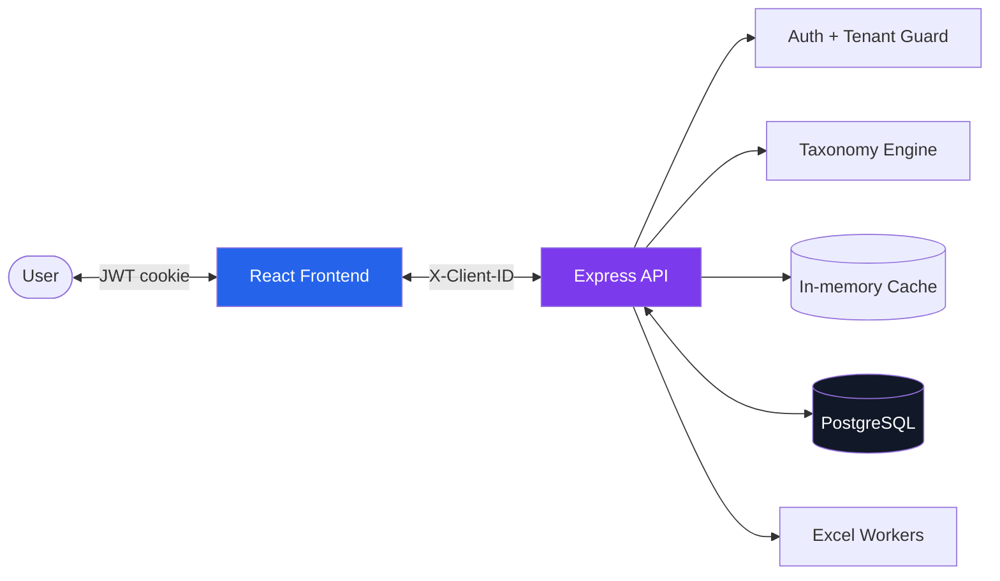
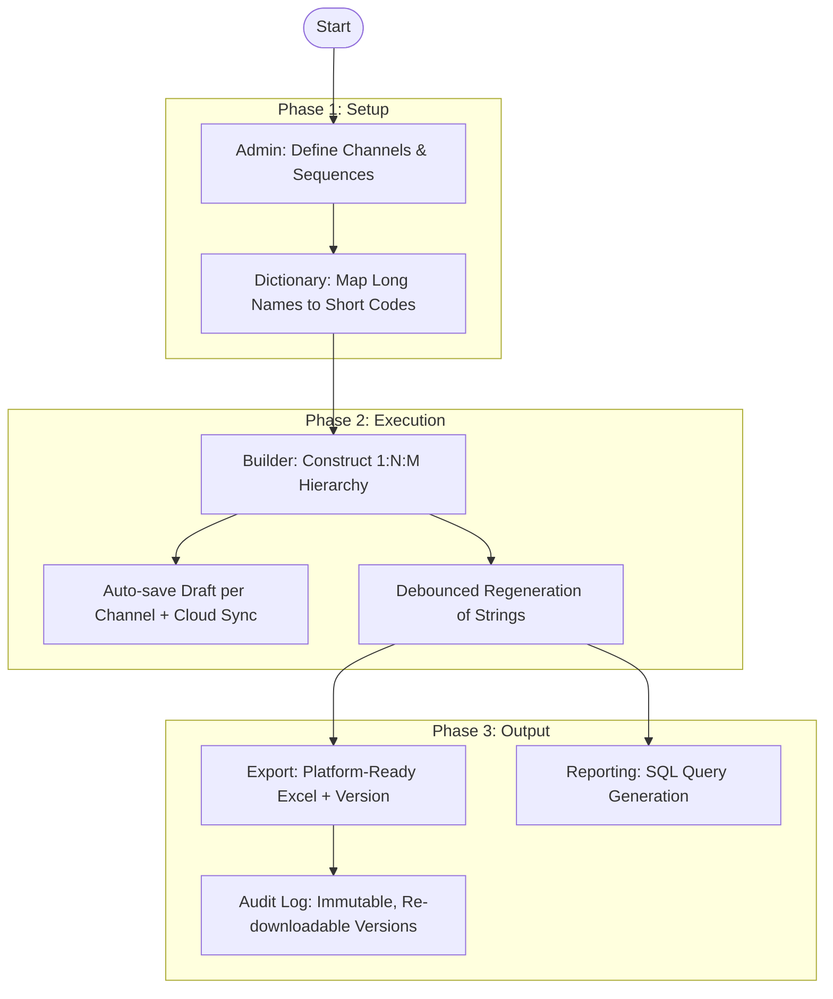

# Project Context

> [!abstract] Overview
> `naming_taxonomy` (**Data Path — Taxonomy Builder**) is a multi-tenant SPA-API application for managing and generating marketing campaign naming conventions. It provides a structured way for agencies and brands to maintain naming integrity across advertising channels, with per-tenant access control, per-channel drafts, and an immutable export audit log.

## 🏗️ Architecture

- **Frontend:** React 18 (TypeScript), Vite, Tailwind CSS.
- **Backend:** Node.js, Express, PostgreSQL, ExcelJS (exports via `worker_threads`).
- **Auth & Tenancy:** JWT in HttpOnly cookies; an async, fail-closed `assertClientAccess` guard backed by the `user_clients` membership table (`super_admin` spans all clients).
- **Communication:** Centralized Axios instance (`frontend/src/api/axios.ts`) with an `X-Client-ID` interceptor for multi-tenancy.

## 🧩 Key Modules

- **Builder:** Manages complex hierarchical state (Campaign → Adset → Creative) in the frontend; taxonomy regeneration is debounced (~500 ms) and memoized for large trees.
  - See [DEVELOPER_GUIDE → Core Features](docs/DEVELOPER_GUIDE.md#-core-features--implementation) · [ADR-020 Builder Perf Profile](docs/adr/e2e-testing/ADR-020-builder-large-tree-perf-profile.md)
- **Taxonomy Engine:** Authoritative generation of naming strings resides in `backend/utils/taxonomyEngine.js` (recursive DFS).
- **Auth & Access:** Role + membership model — JWT auth, `user_clients` join table, and a cached, fail-closed tenant guard with immediate revocation (no re-login).
  - See [DEVELOPER_GUIDE → Access Control](docs/DEVELOPER_GUIDE.md#-access-control--multi-client) · [Client Assignment design](specs/client-assignment_design.md)
- **Persistence (Drafts):** Per-channel `localStorage` drafts with on-demand cloud sync, cross-tab conflict detection, and **Clear Draft** (purges local + cloud). Drafts are stamped with the channel's `rules_version`; a concurrent admin rule edit bumps that version, triggering a stale-rules **hard reload** (purges the local + cloud draft and Session History) in-session, and self-healing a stale draft (purge, no hydrate) on next load.
  - See [ADR-015 Hybrid Persistence](docs/adr/tree-versioning/ADR-015-hybrid-persistence.md) · [ADR-023 Concurrent Rule Edits](docs/adr/misc-fixes/ADR-023-concurrent-rule-edits.md) · [Per-Channel Drafts design](specs/per-channel-drafts_design.md) · [Clear Draft design](docs/adr/clear-draft/clear-draft_design.md)
- **Export Versioning (Audit Log):** Every Excel export records an immutable, re-downloadable `taxonomy_versions` row — no edit/delete path.
  - See [ADR-016 Taxonomy Versions](docs/adr/taxonomy-versions/ADR-016-taxonomy-versions.md)
- **Theming (Light/Dark):** Semantic CSS-variable token layer swapped by a `light`/`dark` class on `<html>`; per-user preference persisted in `users.theme` (default `dark`) with a no-flash `localStorage` mirror. Dark is byte-identical to the original UI; light is WCAG AAA. Toggle in the sidebar + login.
  - See [ADR-022 Theming & Light Mode](docs/adr/light-version/ADR-022-theming-and-light-mode.md)
- **Performance Layer:** Optimized database indexes, a versioned two-tier **in-memory cache** for static data, and `worker_threads` for heavy Excel tasks.
- **Database:** Relational schema supports dynamic naming configurations per channel and client; changes ship as idempotent migrations.
  - See `backend/schema.sql` and `backend/migrations/` (currently `011_*`)

## 🔄 Core Business Flows

## 📚 Resources

> [!info] Documentation Links
> - [DEVELOPER_GUIDE](docs/DEVELOPER_GUIDE.md) — Technical deep-dive, data models, and API reference.
> - [USER_GUIDE](docs/USER_GUIDE.md) — Role-based workflows and screenshots.
> - [README](README.md) — Project setup and feature overview.
> - `shared/` — Shared ADR & CONTEXT templates.
> - `specs/` — Feature design specs.
> - `docs/adr/` — ADRs and implementation plans.

## 🚀 Ongoing Initiatives

> [!success] Delivered
> - **Scalability (Phase 2):** database indexes, standardized pagination, versioned caching, and background workers — see [Scaling Analysis](docs/adr/scaling/SCALING_ANALYSIS.md).
> - **Multi-client access:** per-user client membership via `user_clients` — see [Client Assignment design](specs/client-assignment_design.md).
> - **Export versioning:** immutable audit log with author/date filters — see [ADR-016 Taxonomy Versions](docs/adr/taxonomy-versions/ADR-016-taxonomy-versions.md).
> - **Per-channel drafts + Clear Draft:** isolated drafts per channel, purgeable locally and in the cloud — see [Per-Channel Drafts design](specs/per-channel-drafts_design.md) · [Clear Draft design](docs/adr/clear-draft/clear-draft_design.md).
> - **Builder performance:** debounced `generate-tree` and effective memoization — see [ADR-020 Builder Perf Profile](docs/adr/e2e-testing/ADR-020-builder-large-tree-perf-profile.md).
> - **UX & error hardening:** shared confirm dialogs and centralized error handling — see [ADR-018 Error Handling & UX Hardening](docs/adr/e2e-testing/ADR-018-error-handling-and-ux-hardening.md).
