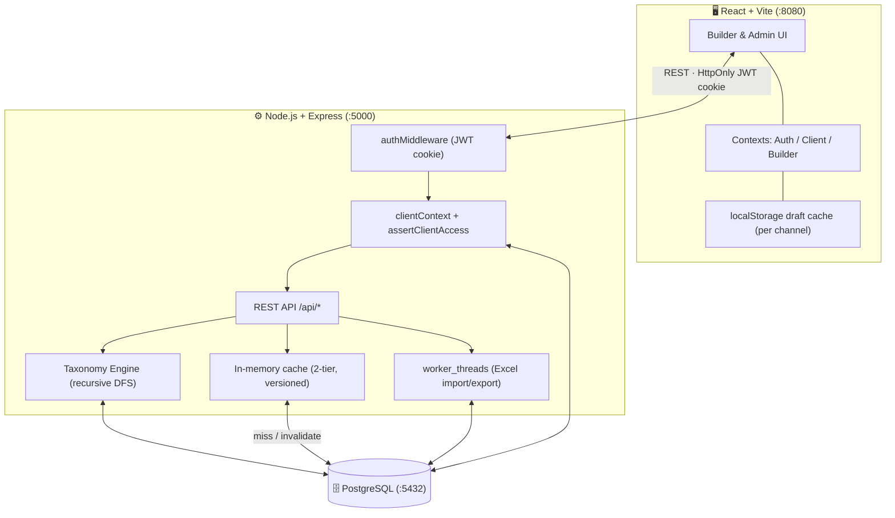
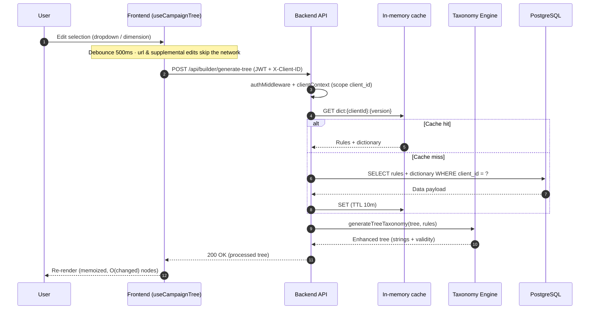

# 🏗️ Data Path — Taxonomy Builder

> A multi-tenant, audit-logged platform for building, validating, and versioning marketing taxonomies and campaign structures — from a visual hierarchy builder all the way to reporting SQL.

## ✨ What the project does

**Data Path — Taxonomy Builder** streamlines the creation, management, and versioning of marketing taxonomies. Teams construct nested campaign hierarchies (Campaign → Ad Set → Creative) in a reactive visual builder, enforce naming conventions through a shared dictionary and per-channel rules, export to Excel with an immutable audit trail, and generate reporting SQL that maps taxonomy strings back into dimensions — all behind per-tenant, role-based access control.

## 🚀 Why the project is useful

- 🌳 **Hierarchical Builder** — Construct entire `1 Campaign → N Ad Sets → M Creatives` trees in one reactive interface, with ⚡ debounced atomic string generation that stays fast on large trees (see [ADR-020](./docs/adr/e2e-testing/ADR-020-builder-large-tree-perf-profile.md)).
- 🔒 **Security & Multi-Tenancy** — JWT in HttpOnly cookies, a fail-closed tenant guard, and **per-user multi-client access** (`user_clients`) so a user can be granted a *subset* of clients — with revocation taking effect immediately, no re-login.
- 🛡️ **Concurrent Rule-Edit Safety** — Rule writes are genuinely atomic (single-connection `withTransaction`), and a monotonic per-channel `rules_version` hard-gates any builder whose rules an admin changed mid-session: a blocking **Reload** modal purges the stale draft + session history (local **and** cloud), and the export endpoint re-validates server-side (409 on stale rows). See [ADR-023](./docs/adr/misc-fixes/ADR-023-concurrent-rule-edits.md).
- 💾 **Per-Channel Drafts** — Work auto-saves per channel to `localStorage`, syncs to the cloud on demand, detects cross-tab conflicts, and can be wiped everywhere with **Clear Draft**.
- 📊 **Export + Audit Log** — Every Excel export records an **immutable, re-downloadable** version (author, row count, full JSON), filterable by author and date. Versions can never be edited or deleted.
- 📚 **Dictionary & Rule Builders** — Bulk Excel import of dimension mappings, plus Channel naming-sequence and UTM "Lego" rule editors per channel.
- 🧮 **Reporting** — A `split_part` SQL generator (BigQuery / PostgreSQL compatible) that reverses taxonomy strings into columns, alongside audit & health alerts.
- ⚡ **Built for Scale** — Two-tier version-invalidated caching, `worker_threads` for Excel processing, and paginated list APIs.

> [!TIP]
> New here? Read the [User Guide](./docs/USER_GUIDE.md) for role-based workflows, or the [Developer Guide](./docs/DEVELOPER_GUIDE.md) for architecture, data models, and the full API surface.

## 🏗️ Architecture

Three containers cooperate over HTTPS: the **React** frontend, the **Express** backend (which hosts the Taxonomy Engine, cache, and Excel workers), and **PostgreSQL**. The frontend never touches the database directly — every read/write flows through the authenticated API, which owns all trust decisions.



## 📡 Data Flow

Builder taxonomy generation is **debounced (~500 ms)** and only fires for inputs the engine consumes, with a versioned two-tier cache shielding Postgres.



## 📁 Project Structure

| Folder | Description |
| :--- | :--- |
| `/frontend` | ⚛️ React 18 + Vite + TypeScript app — modular builder components, admin pages, contexts, and hooks (`src/components`, `src/pages`, `src/context`, `src/hooks`). |
| `/backend` | 🖧 Express API, recursive Taxonomy Engine, Excel workers, and `migrations/` (12 idempotent steps applied on boot). |
| `/shared` | 🧰 Shared ADR & CONTEXT templates used across docs. |
| `/specs` | 📝 Feature design specs (e.g. per-channel drafts, client assignment). |
| `/tests` | 🔬 Test suites and fixtures. |
| `/docs` | 📚 ADRs (`docs/adr/`) plus the [DEVELOPER_GUIDE](./docs/DEVELOPER_GUIDE.md) and [USER_GUIDE](./docs/USER_GUIDE.md). |
| `/uploads` | 🗃️ Temporary storage for Excel imports. |

> [!NOTE]
> **Tech stack:** Express · PostgreSQL (`pg`) · JWT (`jsonwebtoken`) · ExcelJS · `worker_threads` on the backend; React 18 · Vite 5 · TypeScript · Axios · Tailwind CSS on the frontend. The whole stack is containerized with Docker.

## 🔧 Getting Started

### Prerequisites
- 🐳 **Docker Desktop** installed and running.

### Installation & Launch

1. **Clone the repository:**
   ```bash
   git clone https://github.com/aravindGitHub1994/naming-taxonomy.git
   cd naming-taxonomy
   ```

2. **Start the application:**
   ```bash
   docker-compose up -d --build
   ```
   This brings up the frontend (`:8080`), backend (`:5000`), and PostgreSQL (`:5432`). Database migrations in `backend/migrations/` run automatically on backend start.

3. **Initialize Database & Seed Data:**
   ```bash
   # Seed the Super Admin account
   docker exec taxonomy-backend node seed_user.js

   # Seed taxonomy rules & dictionary from the template
   docker exec taxonomy-backend node seed.js
   ```

4. **Access the App:**
   - 🖥️ **Frontend**: http://localhost:8080
   - 🔌 **Backend API**: http://localhost:5000

> [!TIP]
> Usernames follow the **`firstname.lastname`** convention and are auto-generated when a Super Admin creates a user. Sign in from the Data Path login screen, then use the **client switcher** to pick your active tenant.

## 📖 Where to get help

- 📘 **Developer Guide** — architecture, data models, and API reference: [`docs/DEVELOPER_GUIDE.md`](./docs/DEVELOPER_GUIDE.md)
- 📗 **User Guide** — role-based workflows and screenshots: [`docs/USER_GUIDE.md`](./docs/USER_GUIDE.md)
- 🧭 **Project Glossary / Context** — domain terms and conventions: [`CONTEXT.md`](./CONTEXT.md)
- 📑 **Architectural Decisions** — the "why" behind features: [`docs/adr/`](./docs/adr/)
- 🚩 **Support** — open an issue in the tracker for bugs or feature requests.

---
*Built with ❤️ by the Data Path team.*
